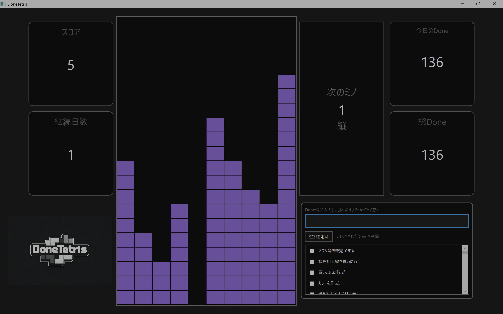

# DoneTetris

WPF + SQLite で作った、ゲーミフィケーション型のDoneリストアプリです。  
Done（やったこと）を記録するとテトリスのブロック（棒ミノ）を1回配置でき、行消去数がスコアになります。

## 主な機能
- Doneの追加（右下入力欄に入力して Enter で保存）
  - 「。」区切りで複数Doneを一括追加可能
  - 空入力時は警告表示
- 今日のDone一覧表示（チェックして選択削除）
- 継続日数（CurrentStreak）の管理（SQLite Meta）
- テトリス盤面（10×20）
  - ミノは棒型（長さ1〜5）
  - 右クリックで縦/横回転
  - クリック列を中心に落下配置
  - 行消去＆スコア加算
- データ永続化（SQLite）
  - Move履歴から盤面を再構築（再起動しても復元）

## 技術スタック
- C# / .NET（WPF）
- SQLite（Microsoft.Data.Sqlite）

## データ構造（概要）
- Done：Done本文、日付、追加バッチ、付与ミノ長さ
- Move：配置ログ（DoneIdに1:1で紐付け）
- Meta：継続日数・最終達成日（Key-Value）

## 起動方法
1. Visual Studioでソリューションを開く
2. 実行（F5）

## 今後の改善案
- 保存成功/失敗時の入力欄枠色演出（緑/赤点滅）
- 次ミノプレビューの描画強化
- MVVMへのリファクタリング
